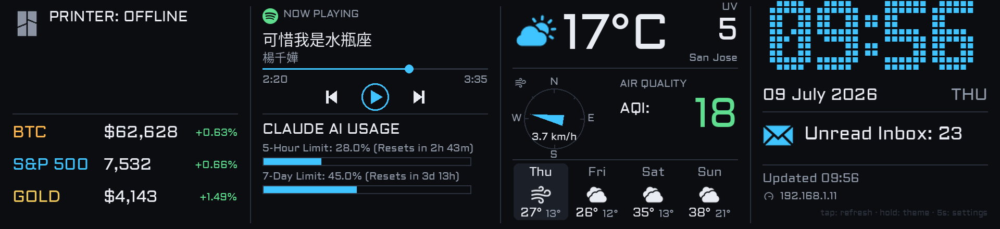

# Pi Ultrawide LCD Dashboard

An always-on information dashboard for the **GeeekPi 11.26" 1920x440 HDMI LCD** (capacitive touch), driven by a Raspberry Pi Zero 2W. Weather, markets, now-playing, AI usage, mail and a clock — in four columns across an ultrawide bar panel.



## Credits

This project is a fork of **[czuryk/Waveshare-ePaper-10.85-dashboard](https://github.com/czuryk/Waveshare-ePaper-10.85-dashboard)** by **czuryk** (Mike Sevbo) — an e-ink dashboard for the Waveshare 10.85" e-Paper HAT+. The widget set, the integrations (Strava, Bambu Lab, Roborock, Spotify, Gmail, weather) and the overall design are his work. All credit for the original concept and implementation goes to him.

This fork ports it from **1-bit e-paper to a full-colour HDMI LCD**, which changed the renderer, the geometry, and the refresh model. See [Changes from the e-paper original](#changes-from-the-e-paper-original).

> The upstream repository does not publish a LICENSE file. Please check with the original author before redistributing.

---

## What's on the dashboard

Four columns, left to right, exactly as pictured above.

### Column 1 — Printer & Markets

* **Bambu Lab 3D printer** *(top)* — live print status, completion percentage, time remaining and current layer. Reads local MQTT over your LAN; shows `PRINTER: OFFLINE` when the printer is powered down or unreachable.
* **Markets** *(bottom)* — BTC, S&P 500 and gold (US $/oz), each with its daily % change, coloured green/red. Data from Yahoo Finance; no API key needed.

### Column 2 — Now Playing & AI usage

* **Bluetooth now-playing** *(top)* — pair your phone (the Pi advertises as `Pi_Dashboard`) and it shows the current track, artist, elapsed/total time and a progress bar, read over BlueZ AVRCP while the phone plays from any app. Tap the on-screen ⏮ ⏯ ⏭ buttons to control playback. No audio backend — only the metadata rides the AVRCP control channel. Song and artist render with Noto Sans CJK, so non-Latin names display correctly.
* **Claude AI usage** *(bottom)* — your 5-hour and 7-day limits as percentages with reset countdowns and progress bars.

### Column 3 — Weather & Air Quality

* **Current conditions** — large temperature, a condition icon, the UV index (highlighted amber at 6+) and the resolved location name.
* **Wind** — a compass rose with a direction arrow and speed in km/h.
* **Air quality** — European AQI, coloured green / white / red by severity, inverted into a filled badge when it's high.
* **4-day forecast** — weekday, condition icon and high/low for each of the next four days, with today's card highlighted.

Data comes from [Open-Meteo](https://open-meteo.com/) (no API key). Location resolves in priority order — ZIP code, then city name, then public-IP geolocation, then a hardcoded lat/lon fallback. See [Set your location](#1-set-your-location-zip-code).

### Column 4 — Clock, Mail & Status

* **Clock** — a large seven-segment time readout, plus date and weekday.
* **Gmail** — unread count for your primary inbox, with the envelope icon highlighted when mail is waiting.
* **Status footer** — last data refresh, the Pi's IP address, and a reminder of the touch gestures.

### Screen behaviour

* **Tap** anywhere — force an immediate refetch of all data (rate-limited to once per 15 s).
* **Press & hold ~1.2 s** — toggle the light / dark theme.
* **Press & hold 5 s** — open the on-screen [Settings menu](#the-on-screen-settings-menu).
* **Screensaver** — after 10 minutes idle the dashboard is replaced by a drifting clock on black; the next touch brings it straight back. With an [HC-SR04 sensor](#proximity-wake-sensor-optional) fitted, walking up to the panel wakes it too. The idle timeout is adjustable on-screen under **Settings → Firmware** (the code default lives in `SCREENSAVER_SECONDS` in `main.py`; `0` disables it).

---

## Optional widgets (disabled by default)

These are inherited from the original project and are switched off in `main.py`. Each takes the slot of the widget listed, so enabling one *replaces* what's currently shown there.

| Widget | Flag | Takes the slot of | What it shows |
| --- | --- | --- | --- |
| **Strava** | `ENABLE_STRAVA` | Bambu printer (col 1 top) | Total and yearly distance and ride counts, split by bike / hike |
| **Roborock** | `ENABLE_ROBOROCK` | Now-playing (col 2 top) | Vacuum battery, status, and area cleaned during a run |
| **Antigravity** | `ENABLE_ANTIGRAVITY` | Now-playing (col 2 top) | Antigravity usage limit and reset time |
| **Spotify** (via Last.fm) | `ENABLE_SPOTIFY` | Claude usage (col 2 bottom) | Currently playing track and artist |

Where two widgets compete for a slot the first one wins: `ENABLE_ROBOROCK` beats `ENABLE_ANTIGRAVITY` beats the now-playing widget, and `ENABLE_CLAUDE` beats `ENABLE_SPOTIFY`. So to see Spotify you must also set `ENABLE_CLAUDE = False`.

If both `ENABLE_CLAUDE` and `ENABLE_SPOTIFY` are off, column 2's lower slot falls back to a **time-progress** widget (day / month / year elapsed). With everything off the dashboard boots into that fallback set and needs no credentials at all.

Setup for these lives in [Optional integrations](#optional-integrations).

---

## Hardware

* Raspberry Pi Zero 2W (tested) with a **mini-HDMI → HDMI** adapter
* [GeeekPi 11.26" 1920x440 HDMI LCD, capacitive touch](https://wiki.52pi.com/index.php/11.26-inch-1920x440-Capacitive-Touch-Screen)
* HDMI cable + USB cable — the USB link carries the touch panel, which enumerates as a standard USB HID touchscreen, no driver needed
* microSD card, 8 GB or larger
* *(optional)* an **HC-SR04 ultrasonic sensor** to wake the screensaver on approach — see [Proximity wake sensor](#proximity-wake-sensor-optional)

### Proximity wake sensor (optional)

An HC-SR04 pointed out from the panel wakes the screensaver when you walk up to it, so the dashboard is already showing before you reach the screen. Without it (or if `gpiozero` isn't installed) nothing changes — the screensaver still wakes on touch.

Wire it to the Pi's 40-pin header using **BCM** pin numbers:

| HC-SR04 | Pi header | Note |
| --- | --- | --- |
| `VCC` | 5V (pin 2) | the sensor will not fire reliably at 3.3V |
| `GND` | GND (pin 6) | |
| `TRIG` | GPIO23 (pin 16) | |
| `ECHO` | GPIO24 (pin 18) | **through a voltage divider — not optional** |

`ECHO` idles at 5V and the Pi's GPIOs are 3.3V-only, so connect it through a divider: a **1 kΩ** resistor in series from `ECHO`, and a **2 kΩ** resistor from that junction (which goes to GPIO24) to GND. That lands GPIO24 at 5 × 2/(1+2) = 3.3V. A bare `ECHO`→GPIO connection will eventually damage the pin.

Then install the GPIO libraries and test the wiring before starting the dashboard:

```bash
sudo apt install -y python3-gpiozero python3-lgpio
sudo python3 proximity.py     # live distance readout; prints *** WAKE *** on approach
```

Once it reads sensible distances, restart the service. The wake distance and screensaver timeout are both adjustable on-screen — see [the Settings menu](#the-on-screen-settings-menu). Pins are set near the top of `main.py` (`PROXIMITY_TRIGGER_PIN`, `PROXIMITY_ECHO_PIN`); set `PROXIMITY_ENABLED = False` to disable the sensor entirely.

---

## Setup

### 1. Flash the OS and get on WiFi

Use **Raspberry Pi OS _Lite_ (64-bit)** — the console-only image.

> ⚠️ Do **not** use a "with desktop" image. It runs its own Wayland compositor (`labwc`) which holds the screen and fights `cage` for it, so the dashboard never appears. If you must, switch the Pi to boot to console: `sudo systemctl set-default multi-user.target`.

In **Raspberry Pi Imager**, click the gear icon before writing and set:

* **hostname** — e.g. `raspberrypi`
* **Enable SSH** — with a password or your public key
* **Configure wireless LAN** — your WiFi SSID, password and country code
* **username / password** — remember these; the systemd unit assumes `pi`

This is the easiest way to get WiFi working, because the dashboard's own on-screen WiFi setup needs the dashboard to already be running. Once it *is* running you can switch networks from the touchscreen without a keyboard — see [Changing WiFi later](#changing-wifi-later).

Boot the Pi, then SSH in:

```bash
ssh pi@raspberrypi.local
```

### 2. Check the display mode

```bash
fbset -s      # should report 1920x440
```

> ⚠️ **Do not force an HDMI mode.** The panel advertises 1920x440 over EDID. Adding `hdmi_timings` / `hdmi_mode` to `config.txt`, or `video=HDMI-A-1:…` to `cmdline.txt`, gives a **black screen**. Let KMS pick the EDID mode and remove any such override.

If the panel comes up at another resolution the app scales frames to fit and logs a warning.

### 3. Install system dependencies

The dashboard renders through `cage`, a single-app Wayland kiosk compositor, with `seatd` providing the seat.

```bash
sudo apt update
sudo apt install -y git \
    python3-pygame python3-pil python3-requests \
    cage seatd wlr-randr \
    python3-dbus-next bluez-tools fonts-noto-cjk

sudo systemctl enable --now seatd
```

`seatd` must be enabled explicitly on a Lite image, or `cage` fails with a `libseat` error.

| Package | Why |
| --- | --- |
| `python3-pygame`, `python3-pil` | Rendering — Pillow composes the frame, pygame/SDL blits it |
| `cage`, `seatd`, `wlr-randr` | Kiosk compositor, its seat, and display control |
| `python3-dbus-next`, `bluez-tools` | Bluetooth now-playing widget and headless pairing |
| `fonts-noto-cjk` | Chinese / Japanese / Korean song and artist names |

### 4. Get the code

```bash
git clone https://github.com/xiabo-lab/pi_dashboard.git ~/Pi_dashboard
cd ~/Pi_dashboard
```

### 5. Install Python dependencies

Raspberry Pi OS Bookworm enforces PEP 668, so anything not available from `apt` needs `--break-system-packages`:

```bash
pip3 install --break-system-packages paho-mqtt \
    google-api-python-client google-auth-httplib2 google-auth-oauthlib
```

* `paho-mqtt` — required by the Bambu Lab printer widget.
* the three `google-*` packages — required by the Gmail widget.

The `bambulabs_api` library is **already bundled** in `lib/`, so there is nothing to install for it.

Only if you plan to enable the Roborock widget:

```bash
pip3 install --break-system-packages roborock aiomqtt
```

### 6. Bluetooth pairing agent (optional but recommended)

Lets the Pi accept "Just Works" pairing with no keyboard:

```bash
sudo cp bt-agent.service /etc/systemd/system/
sudo systemctl enable --now bt-agent
```

A phone's AVRCP device otherwise pops a stray mouse cursor onto the screen. This udev rule tells libinput to ignore it:

```bash
sudo cp 99-pidash-ignore-avrcp-pointer.rules /etc/udev/rules.d/
sudo udevadm control --reload
```

### 7. Configure your integrations

Do this **before** enabling the service — the OAuth flows call `input()`, which a systemd service cannot answer. See [Configuration](#configuration) below.

With no configuration at all the dashboard still runs: weather, markets, clock and the Bluetooth widget need no credentials.

### 8. Start it

The dashboard needs a graphical seat, so it **cannot** be launched from a plain SSH session. Run it from systemd, which also starts it on boot.

```bash
sudo cp ~/Pi_dashboard/pi-dashboard.service /etc/systemd/system/
sudo systemctl daemon-reload
sudo systemctl enable --now pi-dashboard
journalctl -u pi-dashboard -f      # watch it start
```

A healthy start logs `Display ready: 1920x440 via SDL driver 'wayland'`.

> The unit hardcodes `/home/pi/Pi_dashboard`. If your Pi username differs, edit `WorkingDirectory` and `ExecStart` to match — otherwise the service restart-loops with `can't open file … No such file or directory`.

After any code change:

```bash
sudo systemctl restart pi-dashboard
```

---

## Configuration

Widget toggles (`ENABLE_*`) live at the top of `main.py`. Personal credentials do **not** — they live in files that are gitignored, so they never end up in the repository:

| File | Holds | Created by |
| --- | --- | --- |
| `device_conf.json` | Bambu printer IP / serial / access code, Roborock email | you, from `device_conf.example.json` |
| `settings.json` | Weather ZIP code, screensaver timeout, proximity wake distance | the on-screen Settings menu |
| `claude_creds.json` | Claude OAuth token | `claude.interactive_auth()` |
| `token.json` | Gmail OAuth token | `gmail_auth.py` |

`main.py` reads all of them at runtime. That is why you can safely publish your fork of this repo.

### 1. Set your location (ZIP code)

Easiest, and it keeps your location out of the repo — **hold the screen for 5 seconds → Zip Code**, type it on the numeric keypad, confirm. It's saved to `settings.json` and the weather re-resolves immediately, no restart.

Alternatively, edit `main.py`:

```python
LOCATION_ZIP = '10001'          # a postal code, resolved via zippopotam.us
LOCATION_ZIP_COUNTRY = 'us'
```

The dashboard ships **unpinned** (`LOCATION_ZIP = ''`, `USE_IP_LOCATION = True`), so out of the box the weather follows the Pi's public IP. That's convenient but a VPN or unusual ISP routing can place you in the wrong city — set a ZIP for an exact fix.

### 2. Bambu Lab 3D printer

You do **not** need to enable LAN Mode on the printer.

1. On the printer's screen go to **Settings → Network** and note the **IP address**, **serial number** and **access code**.
2. Give the printer a static DHCP reservation on your router — otherwise its IP changes and the widget goes offline.
3. Copy the example config and fill it in:

```bash
cp device_conf.example.json device_conf.json
nano device_conf.json
```

```json
{
  "printer": {
    "IP": "192.168.1.50",
    "SERIAL": "your-printer-serial",
    "ACCESS_CODE": "your-lan-access-code"
  }
}
```

4. Ensure `ENABLE_BAMBU = True` in `main.py`, then restart the service.

`device_conf.json` is gitignored. Without it the printer widget simply shows `PRINTER: OFFLINE` rather than crashing.

### 3. Claude account

Shows your Claude Code usage limits. Auth is a browser OAuth flow, so run it **on your desktop**, not the headless Pi.

**On your desktop**, in a copy of this repo:

```bash
python -c "import claude; claude.interactive_auth()"
```

1. It prints an authorization URL. Open it and log in with your Claude account.
2. You'll be redirected to a dead `localhost:18924/callback?code=…` page — that's expected.
3. Copy the **full** URL from the address bar and paste it back at the prompt.
4. It writes `claude_creds.json`.

**Then copy it to the Pi:**

```bash
scp claude_creds.json raspberrypi.local:~/Pi_dashboard/
ssh raspberrypi.local "sudo systemctl restart pi-dashboard"
```

Set `ENABLE_CLAUDE = True` in `main.py`. The token self-renews from its refresh token, so this is a one-time step.

### 4. Gmail account

Shows your unread inbox count, read-only. There is no `ENABLE_GMAIL` flag — the widget activates as soon as a valid `token.json` is present.

**In the Google Cloud Console (one-time):**

1. Create a project and enable the **Gmail API**.
2. Configure the **OAuth consent screen** (type: External). Under **Test users**, add your own Gmail address — skip this and Google returns `access_denied`.
3. Create an **OAuth 2.0 Client ID** of type **Desktop app**. Download the JSON, rename it to `credentials.json`, and put it next to `gmail_auth.py`.

**On your desktop:**

```bash
pip install google-auth-oauthlib google-api-python-client
python gmail_auth.py
```

A browser opens; grant read-only access. It writes `token.json` and prints your unread count to confirm.

**Then copy it to the Pi:**

```bash
scp token.json raspberrypi.local:~/Pi_dashboard/
ssh raspberrypi.local "sudo systemctl restart pi-dashboard"
```

`credentials.json` stays on your desktop — the Pi only ever needs `token.json`, and it refreshes itself from then on.

### Changing WiFi later

Once the dashboard is running you never need a keyboard again. **Hold the screen for 5 seconds → WiFi**:

* Nearby networks are scanned and listed with signal strength and a lock icon for secured ones.
* Tap one, type the password on the on-screen keyboard (letters / `?123` symbols / Shift), and tap **Connect**.

It drives `nmcli`, so NetworkManager saves the profile and reconnects on boot. Any stale profile for that SSID is cleared first, so a retry can't fail with `key-mgmt: property is missing`.

---

## The on-screen Settings menu

Hold the screen for **5 seconds** to open it. Five sub-screens, each tile showing a live subtitle (current SSID, paired phone, ZIP, version):

| Screen | What it does |
| --- | --- |
| **WiFi** | Scan and join networks with an on-screen keyboard |
| **Bluetooth** | Pair a new phone (`Pi_Dashboard`), or forget a paired one |
| **Zip Code** | Numeric keypad for the weather ZIP; applied immediately |
| **Account** | The connected Claude and Google accounts; **Edit** opens a keyboard to set the Bambu printer's IP / access code / serial |
| **Firmware** | App version, hostname, IP, current WiFi, Python version, uptime — plus two live-applied steppers: the **screensaver idle timeout** (1–60 min) and, when an HC-SR04 is fitted, the **screen wake distance** (5–200 cm) |

`Close` returns to the dashboard. Everything runs as root under the service, so there's no sudo prompt. The menu needs the app running under `cage` — it can't be driven over SSH.

---

## Optional integrations

### Strava

1. Create an API Application in your Strava API settings; note the **Client ID** and **Client Secret**.
2. Set `ENABLE_STRAVA = True` and run `python3 main.py` from a terminal.
3. It asks for the ID/secret and prints an authorization URL. Open it, click Authorize, and you'll land on a dead `localhost` page.
4. Paste the `code=…` value back into the terminal. It saves `activity:read_all` tokens to `strava_token.json`.

### Roborock

1. Put your Roborock account email in the `roborock` block of `device_conf.json`.
2. Set `ENABLE_ROBOROCK = True` and run `python3 main.py` from a terminal.
3. It requests a one-time password, emailed to you. Enter the 6-digit code; the session is saved locally.

Needs `pip3 install --break-system-packages roborock aiomqtt`.

### Spotify (via Last.fm)

The official Spotify API needs a local web server for token renewal, so the dashboard reads the current track from Last.fm instead.

1. Connect your Spotify account to Last.fm.
2. Create a Last.fm API account to get an **API key**.
3. Fill in `LASTFM_CONF` in `main.py` with the key and your Last.fm username, and set `ENABLE_SPOTIFY = True`.

After setup you don't need to use Last.fm directly, and a paid account isn't required — keep using Spotify as normal.

---

## Reference

### Command-line options

| Flag | Purpose |
| --- | --- |
| `--preview [file.png]` | Render one frame to a PNG and exit. Needs no display — useful for checking layout over SSH. |
| `--windowed` | Run in a window instead of fullscreen (desktop testing). |
| `--theme {dark,light}` | Starting theme. Default `dark`. |

### Touch & keyboard

| Gesture | Action |
| --- | --- |
| Tap | Refetch all data (rate-limited to once per 15 s) |
| Press & hold ~1.2 s | Toggle light / dark theme |
| Press & hold 5 s | Open the Settings menu (a progress bar fills as you hold) |
| Tap during screensaver | Return to the dashboard (wakes only; does not also refresh) |
| `R` / `T` / `S` / `Esc`,`Q` | Refresh / theme / settings / quit (with a keyboard attached) |

---

## How it works

* **Asynchronous data fetching.** Each service (weather, printer, markets, Claude, Gmail…) is polled by its own background thread at its own interval. A slow API or a dropped connection in one never blocks the others or freezes the UI.
* **Change-driven rendering.** The main loop polls touch at 30 Hz but only composes and blits a frame when something visible changes. Every data write bumps a revision counter; the renderer compares `(clock minute, revision, theme, dim state)` against the last frame and skips the redraw if they match. An idle screen costs almost nothing.

**Initial population is deliberately slow.** On first launch widgets show placeholders or zeros and fill in over a few minutes. Initial requests are staggered on purpose — it avoids a CPU spike, spares the Pi's network stack, and respects the upstream APIs' rate limits.

### Why a moving clock instead of switching the panel off

This GeeekPi LCD exposes **no backlight control** (`/sys/class/backlight` is empty), ignores `vcgencmd display_power` under KMS, and **does not support HDMI-CEC** (it NACKs CEC commands). Cutting the HDMI signal with `wlr-randr --off` doesn't sleep it either — it just shows a "No Signal" OSD with the backlight still lit.

So there is no software way to turn this panel's backlight off. The drifting clock is the best available option: it avoids the OSD and prevents burn-in from static content, though the backlight stays on. For true power-off you'd need a hardware switch — a smart plug or GPIO relay — on the panel's power.

If `wlr-randr` or the touch device isn't found the screensaver disables itself and the screen simply stays on. It can never get stuck dark.

---

## Changes from the e-paper original

If you're coming from [the Waveshare 10.85" build](https://github.com/czuryk/Waveshare-ePaper-10.85-dashboard):

* **`display.py` replaces the e-paper driver.** The `epd10in85` driver, its `.so` blobs and the SPI setup are no longer imported by anything. They live in `Reference/waveshare_epd/`, off the import path, for rollback — delete `Reference/` once you're happy with the LCD.
* **Geometry changed** from 1360x480 to 1920x440. The panel is 560 px wider but 40 px shorter, so the layout went from 3 columns to 4 and each column's vertical budget tightened.
* **Colour replaces 1-bit.** Icons load as alpha masks and are painted in whatever colour the theme specifies, so the same `icons/*.bmp` files are reused unmodified. Album art stays full-colour RGB instead of being dithered.
* **The `signal.SIGALRM` hardware watchdog is gone.** It existed to recover from the e-paper's SPI busy-wait hangs; an HDMI blit cannot hang that way.
* **The 60-second refresh floor is gone.** That was an e-ink hardware constraint, not a design choice.
* **New in this fork:** the Bluetooth now-playing widget, the on-screen settings menu (WiFi / Bluetooth / ZIP / account / firmware), the moving-clock screensaver, the optional HC-SR04 proximity wake sensor, and the light theme.

The 3D-printed case and assembly video from the original project were designed for the Waveshare panel and do not fit this one, so they aren't reproduced here — see the [upstream repository](https://github.com/czuryk/Waveshare-ePaper-10.85-dashboard) if you're building the e-paper version.
